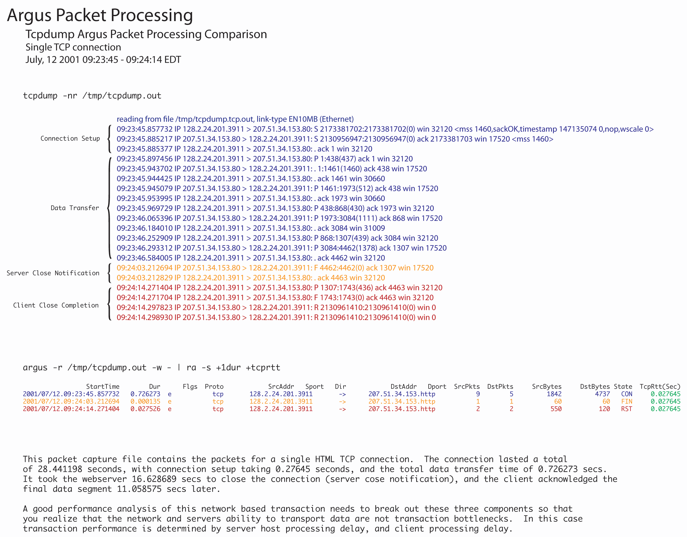

# Argus
Argus is a Real Time Flow Monitor that is designed to perform comprehensive data network traffic auditing.  
https://openargus.org/  
https://openargus.org/using-argus  

# Install on Ubuntu 20.04

```bash
# Requirements
apt install build-essential flex bison

# Argus-3.0.8.2
wget http://qosient.com/argus/src/argus-3.0.8.2.tar.gz
wget http://qosient.com/argus/src/argus-clients-3.0.8.2.tar.gz

tar xvzf argus-3.0.8.2.tar.gz
tar xvzf argus-clients-3.0.8.2.tar.gz

cd argus-3.0.8.2
./configure
make
mane install

cd ..
cd argus-clients-3.0.8.2
./configure
make
make install
```
# Using Argus

 ```bash
# Convert PCAP to argus
argus -r packet.pcap -w packet.argus

# Read argus file
# https://openargus.org/oldsite/ra.examples.shtml
# Param -s : Specify  the  fields  to print.
#            +1dur put duration field at #1 position. Starts with 0.  
ra -r packet.argus -s +1dur

# Example
#       -n  Modify  number  to  name  converstion.   This flag supports 4 states, specified by the
#           modulus of the number of -n flags  set.   By  default  ra*  programs  do  not  provide
#           hostname  lookups,  but  they  do  lookup  port and protocol names.  The first -n will
#           suppress port number to service conversion, -nn will suppress translation of  protocol
#           numbers  to  names (no lookups).  -nnn will return you to full conversion, translating
#           hostnames, port and protocol names, and -nnnn will return you to the default behavior.
#           Because  this  indicator  can  be  set  in  the .rarc file, multiple -n flags progress
#           through the cycle.
#       -u  Write out time values using UTC time format. Epoch format.
#       -c <char>
#            Specify a delimiter character for output columns (default is ' ').
ra -c , -r packet.argus -u -n -s stime ltime dur flgs proto sport dport saddr daddr dco spkts dpkts pkts sbytes dbytes bytes > flows-dataset.csv
```
:warning: Note:
> All features in ra.1.pdf (Param -s).

## Example

